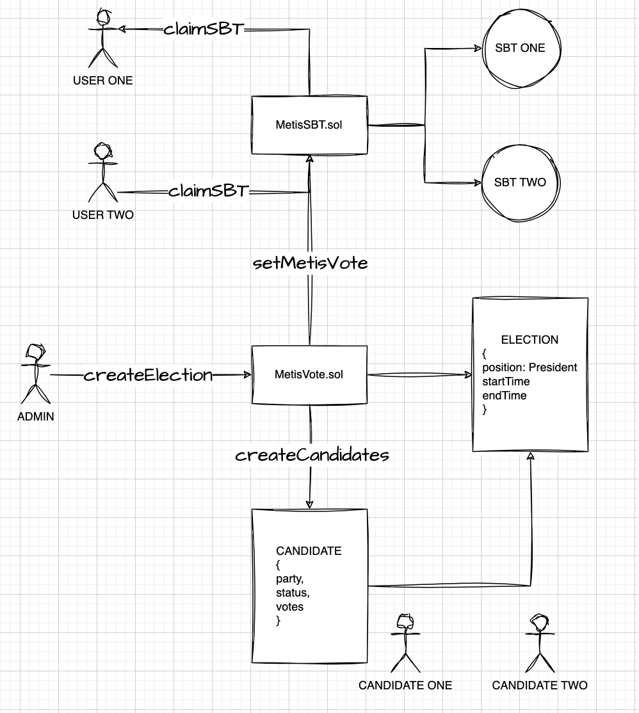
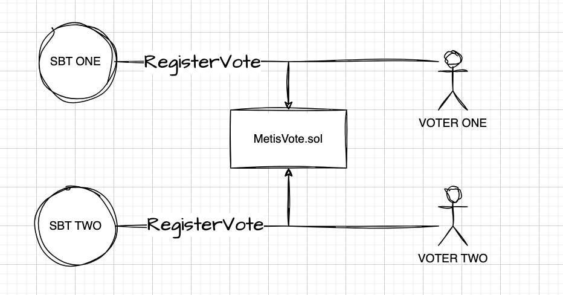
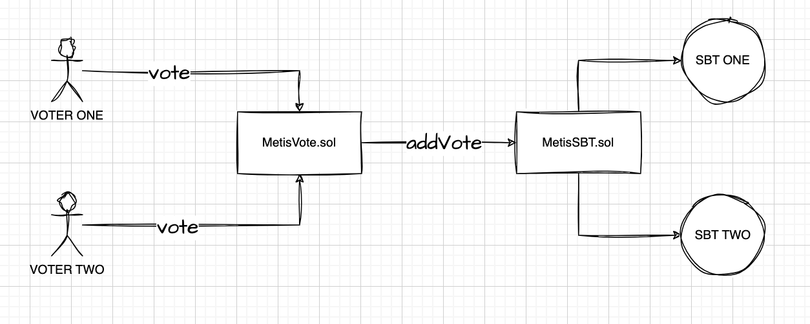

# Metis workshop 05-2023

Think & Dev & Metis Workshop.

### Contracts

1. MetisSBT.sol: SBT token to allow voting and register votes in MetisVote contract

2. Voting.sol: Voting contract with only MetisSBTs.






#### Stack

- yarn
- Node js v18
- Typescript
- Hardhat

#### Commands

- Install:

```bash
cd contracts && yarn
```

- Compile contracts:

```bash
yarn compile
```

- Deploy locally:

```bash
yarn deploy
```

- Deploy to metis testnet: For this step you would need to provide your MNEMONIC inside .envrc file

```bash
export MNEMONIC='YOUR MNEMONIC'

direnv allow .envrc
```

And then run:

```bash
yarn deploy:network metis
```

- Run Test:

```bash
yarn test
```

- Run coverage:

```bash
yarn coverage
```

- Generate abis:

```bash
yarn abis
```

```bash
yarn size
```

#### Tasks

- Set MetisVote contrat in MetisSBT

```bash
npx hardhat set-metis-vote --address <metis-vote-address> --network metis
```

- Set default token uri

```bash
npx hardhat set-default-token-uri --uri <uri> --network metis
```

- Lazy mint batch

```bash
npx hardhat lazy-mint-batch --quantity -<quantity> --network metis
```

-- Create Election

```bash
npx hardhat create-election --position <position> --start-time <startTime> --end-time <endTime> --network metis
```

-- Election Info

```bash
npx hardhat election-info --election-id <electionId> --network metis
```

-- Set new start time election

```bash
npx hardhat set-new-start-time --election-id <electionId> --new-start-time <newStartTime> --network metis
```

-- Set new end time election

```bash
npx hardhat set-new-end-time --election-id <electionId> --new-end-time <newEndTime>  --network metis
```

-- Add candidate

```bash
npx hardhat add-candidate --election-id <electionId> --party <party> --person <person> --network metis
```

### Dapp

#### Stack

- yarn
- Next js
- Tailwind css

#### Commands

- Run dev

```bash
yarn dev
```

---

### Authors

- Alejo Lovallo

  - [Github](https://github.com/AlejoLovallo)
  - [Medium](https://alejolovallo.medium.com/)

- Ayrton Fabian Paredes Rodas

  - [Github](https://github.com/MrRaccxxn)

- [T&D-Twitter](https://twitter.com/thinkanddev)
- [T&D-Facebook](https://www.facebook.com/ThinkandDev)
- [T&D-Instagram](https://www.instagram.com/thinkanddevok/)
- [T&D-LinkedIn](https://www.linkedin.com/company/think-and-dev-llc/)
- [T&D-Web](https://thinkanddev.com)
- Mails: HIRING@THINKANDDEV.COM | HELLO@THINKANDDEV.COM
